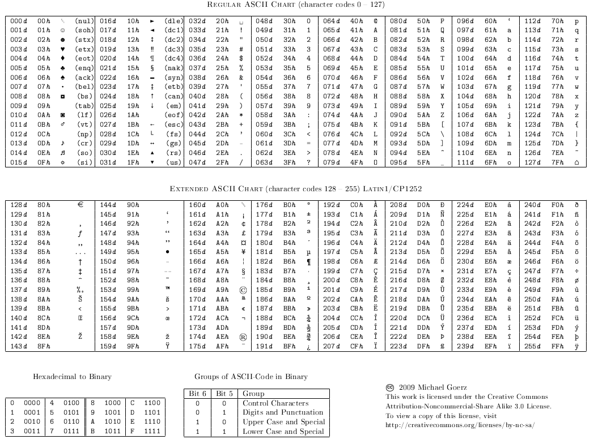

Summary

| *  | Level 1                | Level 2            | Level 3           | Level 4           |
|----|------------------------|--------------------|-------------------|-------------------|
| 0  | :white_check_mark:     | :white_check_mark: |:white_check_mark: |:white_check_mark: |
| 1  | :white_check_mark:     | :white_check_mark: |:white_check_mark: |:white_check_mark: |
| 2  | :white_check_mark:     | :white_check_mark: |:white_check_mark: |:white_check_mark: |
| 3  | :white_check_mark:     | :white_check_mark: |:white_check_mark: |:white_check_mark: |
| 4  | :white_check_mark:     | :white_check_mark: |:white_check_mark: |:white_check_mark: |
| 5  | :white_check_mark:     | :white_check_mark: |:white_check_mark: |:white_check_mark: |
| 6  | :white_check_mark:     | :white_check_mark: |:white_check_mark: |:white_check_mark: |
| 7  | :white_check_mark:     | :white_check_mark: |:white_check_mark: |:white_check_mark: |
| 8  | :white_check_mark:     | :white_check_mark: |:white_check_mark: |:white_check_mark: |
| 9  | :white_check_mark:     | :white_check_mark: |:white_check_mark: |:white_check_mark: |
| 10 | :white_check_mark:     | :white_check_mark: |:white_check_mark: |:white_check_mark: |
| 11 | :white_check_mark:     | :white_check_mark: |:white_check_mark: |:white_check_mark: |
| 12 | :white_check_mark:     | :white_check_mark: |:white_check_mark: |:white_check_mark: |
| 13 | :white_check_mark:     | :white_check_mark: |:white_check_mark: |:white_check_mark: |
| 14 | :white_check_mark:     | :white_check_mark: |:white_check_mark: |:white_check_mark: |
| 15 | :white_check_mark:     | :white_check_mark: |:white_check_mark: |:white_check_mark: |
| 16 | :white_check_mark:     | :white_check_mark: |:white_check_mark: |:white_check_mark: |
| 17 | :white_check_mark:     | :white_check_mark: |:white_check_mark: |:white_check_mark: |
| 18 | :white_check_mark:     | :white_check_mark: |:white_check_mark: |:white_check_mark: |
| 19 | :white_check_mark:     | :white_check_mark: |:white_check_mark: |:white_check_mark: |
| 20 | :white_check_mark:     | :white_check_mark: |:white_check_mark: |:white_check_mark: |
| 21 | :white_check_mark:     | :white_check_mark: |:white_check_mark: |:white_check_mark: |
| 22 | :white_check_mark:     | :white_check_mark: |:white_check_mark: |:white_check_mark: |

Ascii && other

Make a table with same logic assignment

## DIGIT
0 (48) 1 (49) 2 (50) 3 (51) 4 (52) 5 (53) 6 (54) 7 (55) 8 (56) 9 (57)

##ALPHA

A (65) B (66) C (67) D (68) E (69) F (70) G (71) H (72) I (73) J (74) K (75) L (76) M (77) N (78) O (79) P (80) Q (81) R (82) S (83) T (84) U (85) V (86) W (87) X (88) Y (89) Z (90)

a (97) b (98) c (99) d (100) e (101) f (102) g (103) h (104) i (105) j (106) k (107) l (108) m (109) n (110) o (111) p (112) q (113) r (114) s (115) t (116) u (117) v (118) w (119) x (120) y (121) z (122)

Underscore _ (95)
Space   (32) // + 32 pour changer en minuscule
Plus sign '+' (43)
Minus sign '-' (45)
Diviser sign '/' (47)
Modulo sign % (37)
isspace();
Horizontal tab '\t' (9)
Vertiacal tab '\v' (11)
New Line  \n (10)
Form feed '\f' (12)
Carriage return '\r' (13)

str[idx] += 32; put in lowecase
str[idx] -= 32; put in upercase

printf - > #include <stdio.h>
malloc - > #include <stdlib.h>
NULL && size_t -> #include <stddef.h>

alway return the type of your fct
alway nit your varible
inc your idx directly when you enter a while loop
alway secure your malloc just after initialized
comment main if ask a fonction

make tab of same logic

sting manipulation
linked list
argument
etc

argument vector table

0 program name
1
2
4

argc -> argument cunt eauql
argv -> argument vector

Usefull link

https://github.com/JCluzet/42_GradeMe

https://github.com/Binary-Hackers/42_Subjects

https://github.com/48d31kh413k/1337-Piscine-42

https://github.com/luta-wolf/42-examrank

https://github.com/barimehdi77/42-piscine-exam

https://github.com/jraleman/42.Exam-C

https://github.com/fwuensche/42-exam-miner

https://github.com/pasqualerossi/42-School-Exam-Rank-02

Same Exercice type

Basic string manipulation

void	ft_putchar(char c)
{
	write (1, &c, 1);
}

Level 1 -> ft_strlen
		-> ft_putstr
		-> ft_swap
		-> ft_strcmp

probability exercice

	(exercice idea) ft_exclud.c

linked list exercice

Level 3 ->	ft_list_size

Level 4 -> ft_list_foreach
		->	ft_list_removoe_if
		->	sort_list

bit shift exerise

Level 2 -> prints_bits
		-> swap_bits
		-> revere_bits

